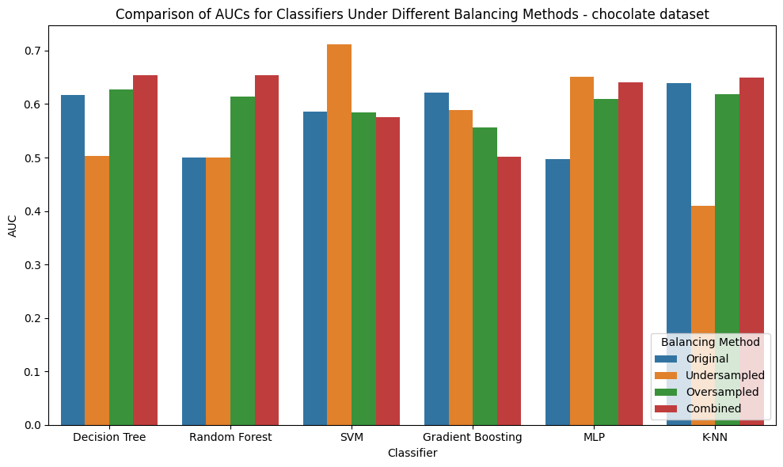
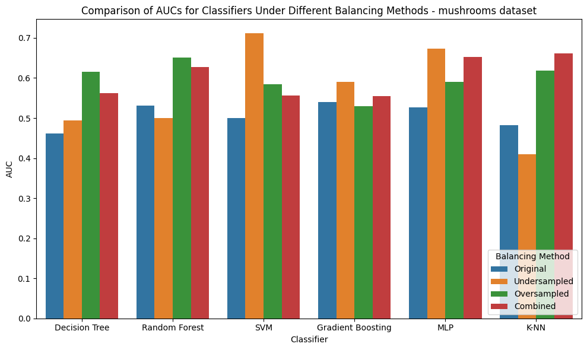
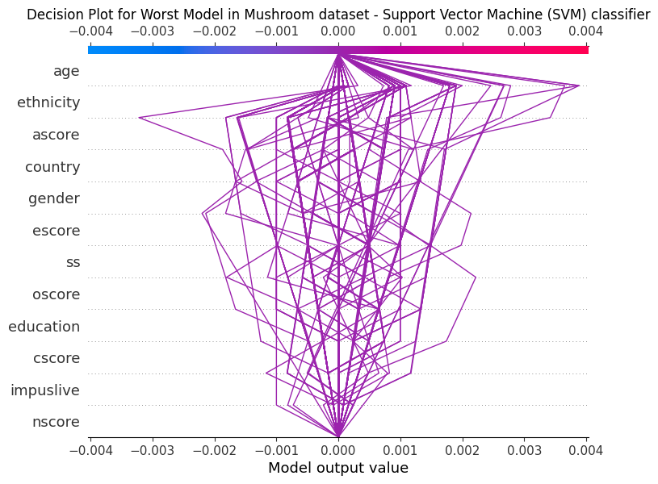
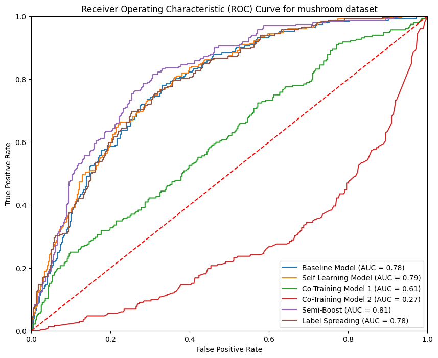

# Problem Statement
## Aims
1. Convert the multi-class problems into binary classification tasks.
2. Predict whether a person is a consumer of chocolate and magic mushroom.
3. Choose the best and worst classifiers for each dataset. 
4. Explain AI models in a scientific manner which should be convincable to non-technical people.
5. Implement models with Semi-Supervised Learning.
## Preview
**Comparing a Pipeline of 6 classifiers on 2 datasets**

**Explainable AI**

**Semi-Supervised Learning**

# Dataset: Drug Consumption Analysis Dataset
The dataset can be found at this link: https://archive.ics.uci.edu/dataset/373/drug+consumption+quantified.
## Description of the Dataset
- Contains a row identifier, 12 features describing the user data, and 18 classification problems related to using 18 different drugs.
- For each drug, it indicates whether a person has 'never used', 'used over a decade ago', 'used in the last decade', 'used in the last year', 'used in the last month', 'used in the last week', or 'used in the last day'.
# Implementation Details
- Split the Dataset and Perform Feature Engineering.
- Perform Supervised Learning using a pipeline of 6 classifiers.
- Identify potential issues in the dataset / the classifier itself.
- Provide results from Evaluation with some useful plots and metrics.
- Summarize the analysis in a report.
- Explain whether certain classifiers make trustable predictions, with the calculation of SHAP values and some visualization plots.
- Prepared labelled and unlabelled data, Implemented and Compared different semi-supervised learning algorithms based on the gradient boosting classifier from assignment 1.
# Project Structure
- You should expect a report in `.pdf` format at the root level.
- Please expand the folder at the root level to view codes.
- This project branches out the analysis into 2 notebooks:
  1. Modelling - please check the file `CSI5155 Assignment 1 Modelling Part- Kelvin Mock 300453668.ipynb`
  2. Evaluation - please check the file `CSI5155 Assignment 1 Evaluation Part - Kelvin Mock 300453668.ipynb`
  3. Calculation of SHAP Values - please check the file `CSI5155 Assignment 2 - Kelvin Mock 300453668.ipynb`
  4. Visualizing the SHAP Values - please check the file `CSI5155 Assignment 2 Plots - Kelvin Mock 300453668.ipynb`
  5. Baseline Model (Gradient Boosting classifier) - `CSI5155 Project - baseline.ipynb`
  6. Self Training method applied on baseline model - `CSI5155 Project - Self Training.ipynb`
  7. Co-Training method applied on baseline model - `CSI5155 Project - Co Training.ipynb`
  8. Semi-Boost method applied on baseline model - `CSI5155 Project - Semi Boost.ipynb`
  9. Label Spreading method applied on baseline model - `CSI5155 Project - Label Spreading.ipynb`
- Models are data dumped into several `.pkl` files from time-to-time in different phases to maintain the code's maintainability.
- The training sets and test sets are also data dumped into several `.pkl` files.
- `choc` directory shows data dumped files related to the Chocolate dataset (which is split from the original dataset).
- `mushrooms` directory shows data dumped files related to the Mushrooms dataset (which is also split from the original dataset).
